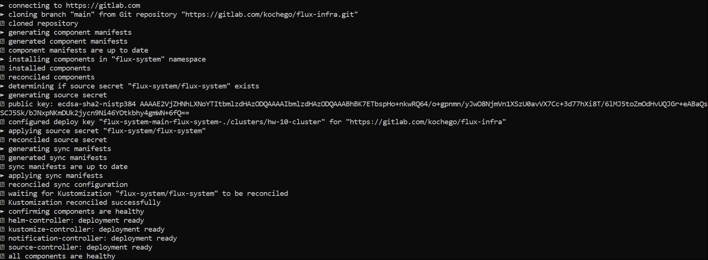

### Подготовка к работе
Авторизоваться в SaaS GitLab, создать проект и поместить туда код из репо microservices-demo (hipster-shop)

#### Создание кластера при помощи terraform - задание со *
https://gitlab.com/otus-kuber-kochego/infra  
yc iam create-token

yc iam service-account create --name k8s-sa-terraform
назначить роль admin

Создать ключ
yc iam key create \
--service-account-id aje0thjrcc09cpdvc4f5 \
--folder-name hw-10 \
--output key.json

yc config profile create sa-terraform

yc config set service-account-key key.json
yc config set cloud-id b1g0i76r68bg9recefif
yc config set folder-id b1g3o66s17eng9eaa442

export YC_TOKEN=$(yc iam create-token)
export YC_CLOUD_ID=$(yc config get cloud-id)
export YC_FOLDER_ID=$(yc config get folder-id)
...

#### Continuous Integration - задание со * 
Создан пайплайн для сборки и выкладки на Docker Hub образов микросервисов
https://gitlab.com/kochego/microservicesdemo


В итоге на Docker Hub имеем набор тэгов <microservicename>-v0.0.1

#### GitOps - flux
Установлен и подготовлен flux v2 по документации https://fluxcd.io/flux/get-started/
```bash
export GITLAB_TOKEN=<my token>
export GITLAB_USER=<my username>
flux bootstrap gitlab \
  --owner=$GITLAB_USER \
  --repository=flux-infra \
  --branch=main \
  --path=./clusters/hw-10-cluster \
  --deploy-token-auth
  
export GITLAB_TOKEN=<my token>
export GITLAB_USER=kochego
flux bootstrap gitlab \
--owner=$GITLAB_USER \
--repository=flux-infra \
--branch=main \
--path=./clusters/hw-10-cluster \
--deploy-token-auth  
```

В репо https://gitlab.com/kochego/flux-infra создаем для проверки манифест clusters/hw-10-cluster/deploy/namespaces/main.yaml и убеждаемся, что он применился в кластер:
```txt
kubectl get ns | grep microservices-demo
microservices-demo   Active   16s
```
Создаем для микросервиса Frontend HelmRelease и кладем его в каталог clusters/hw-10-cluster/deploy/releases/frontend.yaml, ждем синхронизацию, видим, что чарт развернулся автоматически.
```bash
flux reconcile kustomization flux-system --with-source
```
Проверим, что релиз задеплоился 
```txt
kubectl get helmrelease -n microservices-demo
NAME       AGE     READY   STATUS
frontend   2m35s   True    Release reconciliation succeeded
```
Повторим для остальных микросервисов
```txt
kubectl get helmreleases   -n microservices-demo -o wide
NAME                    AGE    READY   STATUS
adservice               65s    True    Release reconciliation succeeded
cartservice             32m    True    Release reconciliation succeeded
checkoutservice         29m    True    Release reconciliation succeeded
currencyservice         29m    True    Release reconciliation succeeded
emailservice            26m    True    Release reconciliation succeeded
frontend                2d3h   True    Release reconciliation succeeded
loadgenerator           24m    True    Release reconciliation succeeded
paymentservice          26m    True    Release reconciliation succeeded
productcatalogservice   26m    True    Release reconciliation succeeded
recommendationservice   26m    True    Release reconciliation succeeded
shippingservice         26m    True    Release reconciliation succeeded
```
### Istio и Flagger
**Установка Istio**  
```bash
curl -L https://istio.io/downloadIstio | sh -
cd istio-1.19.1/bin/
sudo cp istioctl /usr/local/bin/
istioctl manifest apply --set profile=demo
```

**Установка Flagger**  
```bash
helm repo add flagger https://flagger.app
kubectl apply -f https://raw.githubusercontent.com/weaveworks/flagger/master/artifacts/flagger/crd.yaml
helm upgrade --install flagger flagger/flagger --namespace=istio-system --set crd.create=false --set meshProvider=istio --set metricsServer=http://prometheus.monitoring.svc.cluster.local:9090
```
**Istio sidecar injector**  
Добавить лейбл в ns microservice-demo:

apiVersion: v1
kind: Namespace
metadata:
name: microservices-demo
labels:
istio-injection: enabled 

Проверим:
```txt
kubectl get ns microservices-demo --show-labels
NAME                 STATUS   AGE   LABELS
microservices-demo   Active   16d   istio-injection=enabled,kubernetes.io/metadata.name=microservices-demo,kustomize.toolkit.fluxcd.io/name=flux-system,kustomize.toolkit.fluxcd.io/namespace=flux-system
```
Пересоздадим поды
```bash
kubectl delete pods --all -n microservices-demo
```
Проверим что sidecar появился
```txt
kubectl describe pod -l app=frontend -n microservices-demo
Name:             frontend-67b9cfd9b6-8djdv
Namespace:        microservices-demo
...
Init Containers:
  istio-init:
...
Containers:
  server:
    Container ID:   containerd://c27ae5e85b67faf383d9502e8199dc57d1f636326cc93a7dfb390ea6d099a531
...
  istio-proxy:
    Container ID:  containerd://2ddb89b394173334bf08045292d60e3b8610f4d93b2d766ee1fbfd4050d2a419
    Image:         docker.io/istio/proxyv2:1.19.1
    Image ID:      docker.io/istio/proxyv2@sha256:62eba4096af83c286fc8898e77fda09efde37492bd91c16d06f3f99010539ada
...
Events:
  Type    Reason     Age   From               Message
  ----    ------     ----  ----               -------
  Normal  Scheduled  28s   default-scheduler  Successfully assigned microservices-demo/frontend-67b9cfd9b6-8djdv to cl1vhqh391mgb00ss8et-yqyf
  Normal  Pulled     27s   kubelet            Container image "docker.io/istio/proxyv2:1.19.1" already present on machine
  Normal  Created    27s   kubelet            Created container istio-init
  Normal  Started    27s   kubelet            Started container istio-init
  Normal  Pulled     27s   kubelet            Container image "registry.gitlab.com/kochego/microservicesdemo:frontend-v0.0.4" already present on machine
  Normal  Created    27s   kubelet            Created container server
  Normal  Started    26s   kubelet            Started container server
  Normal  Pulled     26s   kubelet            Container image "docker.io/istio/proxyv2:1.19.1" already present on machine
  Normal  Created    26s   kubelet            Created container istio-proxy
  Normal  Started    26s   kubelet            Started container istio-proxy
```
Применим ресурсы gateway и virtualservice при помощи Flux и проверим
```txt
kubectl get gateway -n microservices-demo
NAME       AGE
frontend   4s
kubectl get virtualservice -n microservices-demo
NAME       GATEWAYS       HOSTS                           AGE
frontend   ["frontend"]   ["shop.kuber.kochego.online"]   3m46s
kubectl get svc istio-ingressgateway -n istio-system
NAME                   TYPE           CLUSTER-IP      EXTERNAL-IP    PORT(S)                                                                      AGE
istio-ingressgateway   LoadBalancer   10.96.219.123   51.250.97.78   15021:30677/TCP,80:31609/TCP,443:30296/TCP,31400:30831/TCP,15443:30071/TCP   32m
```
### Canary release
Применим ресурс canary при помощи Flux и проверим  
```txt
kubectl get canary -n microservices-demo
NAME       STATUS        WEIGHT   LASTTRANSITIONTIME
frontend   Initialized   0        2023-10-15T06:07:04Z
```
Сanary обновил pod, добавив ему к названию постфикс primary:
```txt
kubectl get pods -n microservices-demo -l app=frontend-primary
NAME                                READY   STATUS    RESTARTS   AGE
frontend-primary-858b9fc6b9-tfwb2   2/2     Running   0          8m20s
```
Деплоим новую версию и через некоторое время проверяем
```txt
$ kubectl describe canary frontend -n microservices-demo
Events:
Type     Reason  Age              From     Message
  ----     ------  ----             ----     -------
Warning  Synced  9m4s             flagger  frontend-primary.microservices-demo not ready: waiting for rollout to finish: observed deployment generation less than desired generation
Normal   Synced  8m34s            flagger  Initialization done! frontend.microservices-demo
Normal   Synced  7m34s            flagger  New revision detected! Scaling up frontend.microservices-demo
Normal   Synced  7m4s             flagger  Starting canary analysis for frontend.microservices-demo
Normal   Synced  7m4s             flagger  Advance frontend.microservices-demo canary weight 5
Normal   Synced  6m30s            flagger  Advance frontend.microservices-demo canary weight 10
Normal   Synced  5m               flagger  Advance frontend.microservices-demo canary weight 15
Normal   Synced  4m30s            flagger  Advance frontend.microservices-demo canary weight 20
Normal   Synced  3m               flagger  Advance frontend.microservices-demo canary weight 25
Normal   Synced  2m30s            flagger  Advance frontend.microservices-demo canary weight 30
Normal   Synced  2m               flagger  Copying frontend.microservices-demo template spec to frontend-primary.microservices-demo
Normal   Synced  1m (x3 over 7m)  flagger  (combined from similar events): Promotion completed! Scaling down frontend-hipster.microservices-demo

$ kubectl get canaries -n microservices-demo
NAME       STATUS      WEIGHT   LASTTRANSITIONTIME
frontend   Succeeded   0       2023-10-15T11:23:10Z
```


