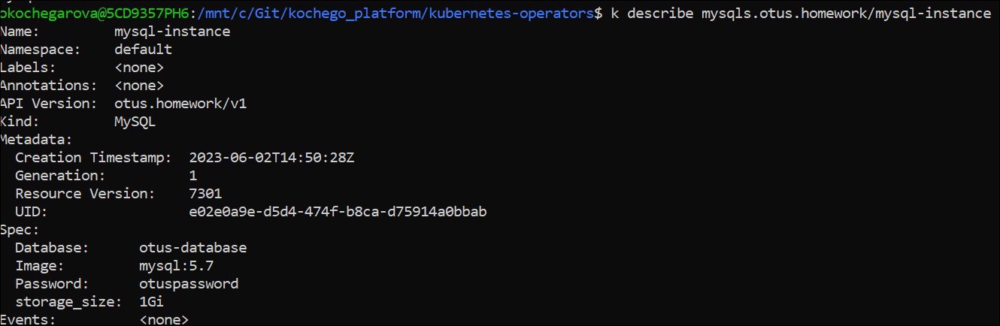
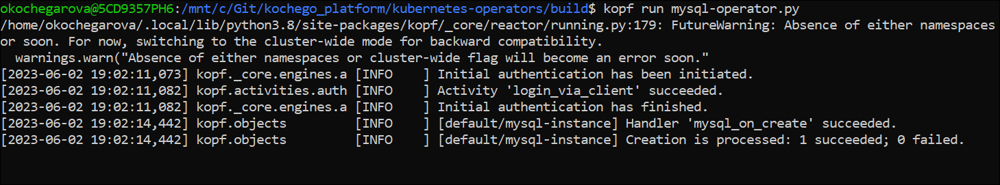
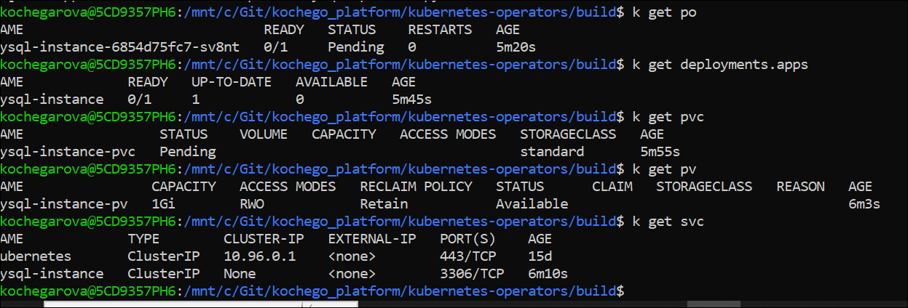
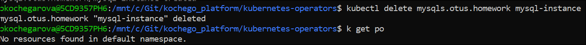
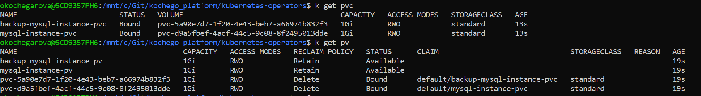
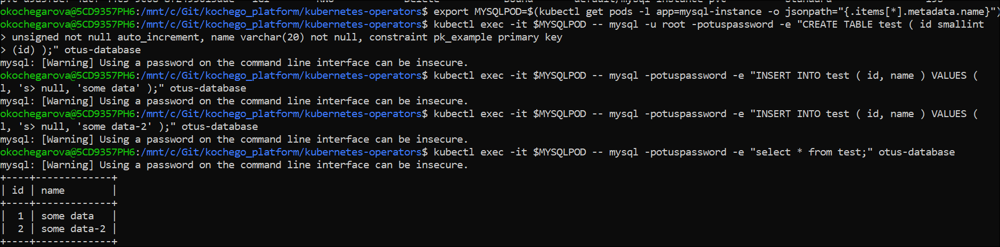
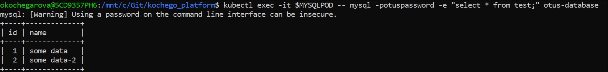
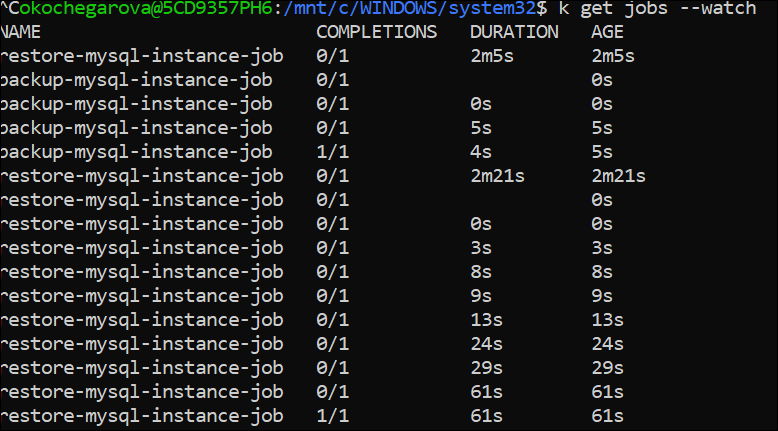

# ДЗ № 7. Custom Resource Definitions. Operators
- **kubernetes-operators/deploy/crd.yml** Создан CRD для MySQL, описана схема ресурса и все поля заданы как обязательные, создание описано в [статье](https://habr.com/ru/companies/otus/articles/669806/)
```bash
 kubectl apply -f deploy/crd.yml
```
Note: описание схемы обязательно в последних версиях k8s
- **kubernetes-operators/deploy/crd.yml** Создан CR MySQL на основе описания CRD со всеми заполненными обязательными полями
```bash
 kubectl apply -f deploy/crd.yml
```
```bash
k get crd
k get mysqls.otus.homework
```

- **kubernetes-operators/build/mysql-operator.py** Написан контроллер на Python
Для проверки запустим 
```bash
kopf run mysql-operator.py
```
Note: предварительно должен быть установлен Python, если его нет и подтянуты необходимые записимости:
```bash
pip install kopf
pip install kubernetes
```

- **Вопрос:** Почему объект создался, хотя мы создали CR, до того, как запустили контроллер?
- **Ответ:** 

Создались ресурсы, описанные в контроллере:

- Была добавлена обработка события удаления ресурсов. По итогу при удалении CR удаляются все дочерние ресурсы
```bash
kubectl delete mysqls.otus.homework mysql-instance
```


- Было добавлено создание PV и PVC для backup и restore job и проверено, что они создались


- Проверено, что с БД можно работать
```bash
export MYSQLPOD=$(kubectl get pods -l app=mysql-instance -o jsonpath="{.items[*].metadata.name}")
kubectl exec -it $MYSQLPOD -- mysql -u root -potuspassword -e "CREATE TABLE test ( id smallint
unsigned not null auto_increment, name varchar(20) not null, constraint pk_example primary key
(id) );" otus-database
kubectl exec -it $MYSQLPOD -- mysql -potuspassword -e "INSERT INTO test ( id, name ) VALUES (
null, 'some data' );" otus-database
kubectl exec -it $MYSQLPOD -- mysql -potuspassword -e "INSERT INTO test ( id, name ) VALUES (
null, 'some data-2' );" otus-database
kubectl exec -it $MYSQLPOD -- mysql -potuspassword -e "select * from test;" otus-database
```

- Удалили и заново создали CR и убедились, что данные сохранились
- Собран докер образ и запушен в докерхаб
```bash
docker build -t olgakoch/otus:kubernetes-operators-mysql kubernetes-operators/build/. && \
docker push olgakoch/otus:kubernetes-operators-mysql
```
- Заново задеплоен оператор, уже на основе образа, который был запушен в докерхаб, предварительно создан сервисный аккаунт, роль и роль байндинг для его работы:
```bash
k apply -f kubernetes-operators/deploy/crd.yml -f kubernetes-operators/deploy/service-account.yml -f  kubernetes-operators/deploy/role.yml -f  kubernetes-operators/deploy/role-binding.yml
k apply -f kubernetes-operators/deploy/deploy-operator.yml
k apply -f kubernetes-operators/deploy/cr.yml
```
Снова проведены проверки работоспособности - заполнена база:
```bash
export MYSQLPOD=$(kubectl get pods -l app=mysql-instance -o jsonpath="{.items[*].metadata.name}")
kubectl exec -it $MYSQLPOD -- mysql -u root -potuspassword -e "CREATE TABLE test ( id smallint
unsigned not null auto_increment, name varchar(20) not null, constraint pk_example primary key
(id) );" otus-database
kubectl exec -it $MYSQLPOD -- mysql -potuspassword -e "INSERT INTO test ( id, name ) VALUES (
null, 'some data' );" otus-database
kubectl exec -it $MYSQLPOD -- mysql -potuspassword -e "INSERT INTO test ( id, name ) VALUES (
null, 'some data-2' );" otus-database
kubectl exec -it $MYSQLPOD -- mysql -potuspassword -e "select * from test;" otus-database
```
Удален CR:
```bash
kubectl delete mysqls.otus.homework mysql-instance
k delete pv mysql-instance-pv (почему-то не удаляется PV при удалении CR)
```
Заново создан CR:
```bash
kubectl apply -f kubernetes-operators/deploy/cr.yml
```
Проверено, что данные доступны и что джобы успешно отработали - бэкап при удалении CR, рестор при создании CR:
```bash
export MYSQLPOD=$(kubectl get pods -l app=mysql-instance -o jsonpath="{.items[*].metadata.name}")
kubectl exec -it $MYSQLPOD -- mysql -potuspassword -e "select * from test;" otus-database
k get jobs --watch
```


