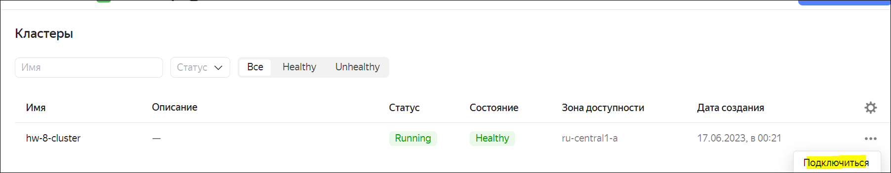
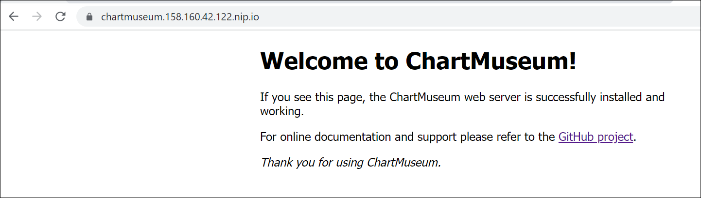
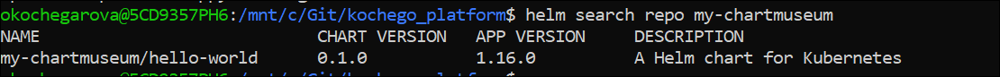
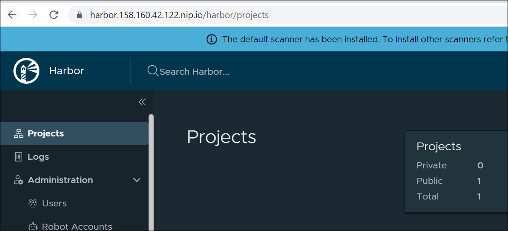
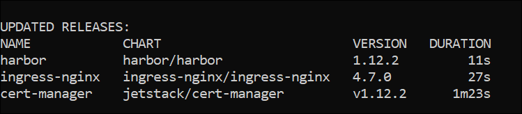
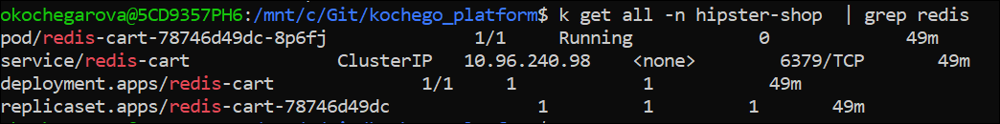
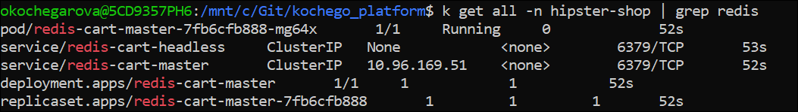
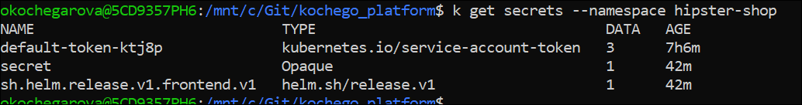
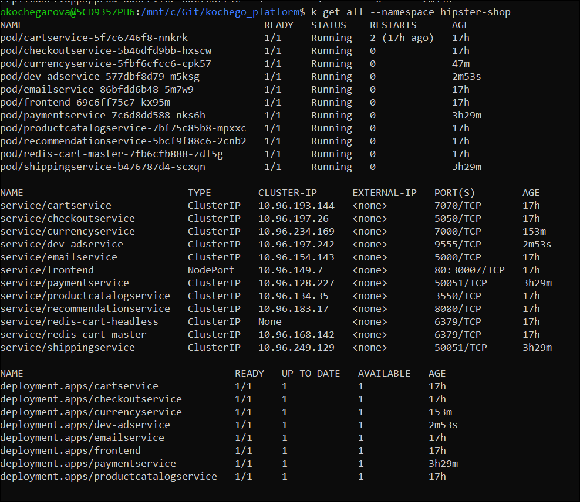

### Подготовка к работе
Создан кластер в Yandex Cloud - Managed Service for Kubernetes

Создана группа узлов из одного узла

Установлен Yandex CLI
```bash
curl -sSL https://storage.yandexcloud.net/yandexcloud-yc/install.sh | bash
```
Проведена его инициализация
```bash
yc init
```
Установлен Helm 3:
```bash
wget -O /tmp/helm-v3.12.1-linux-amd64.tar.gz -c https://get.helm.sh/helm-v3.12.1-linux-amd64.tar.gz && \
tar -xzf /tmp/helm-v3.12.1-linux-amd64.tar.gz -C /tmp && \
chmod a+x /tmp/linux-amd64/helm && \
sudo mv /tmp/linux-amd64/helm /usr/bin/
```

Произведено подключение к кластеру - необходимую команду для подключения можно найти в интерфейсе


### Nginx-ingress - установка при помощи Helm чарта:
```bash
kubectl create ns nginx-ingress && \
helm repo add ingress-nginx https://kubernetes.github.io/ingress-nginx && \
helm repo update && \
helm install ingress-nginx ingress-nginx/ingress-nginx --namespace=nginx-ingress && \
--version=4.7.0
```
Проверка:
```bash
k get all --namespace nginx-ingress
```

### Certmanager - установка с помощью Helm чарта и настройка:
Предварительно установили необходимые CRD для работы certmanager:
```bash
kubectl apply -f https://github.com/cert-manager/cert-manager/releases/download/v1.12.2/cert-manager.crds.yaml
```
Установлен certmanager:
```bash
helm repo add jetstack https://charts.jetstack.io && \
kubectl create ns cert-manager && \
helm upgrade --install cert-manager jetstack/cert-manager --wait \
--namespace=cert-manager \
--version=1.12.2
```
Добавлены объекты ClusterIssuer, Certificate для certmanager
```bash
kubectl apply -f kubernetes-templating/cert-manager/issuer.yaml
```
Проверена работа:
```bash
kubectl describe clusterissuers -n cert-manager
```

### Chartmuseum - установка с помощью Helm чарта:
```bash
kubectl create ns chartmuseum && \
helm repo add chartmuseum https://chartmuseum.github.io/charts && \
helm upgrade --install chartmuseum chartmuseum/chartmuseum --wait \
--namespace=chartmuseum \
--version=3.10.0 \
-f kubernetes-templating/chartmuseum/values.yaml
```
Проверим, что установился, отображается и защищен сертификатом:
```bash
helm ls -n chartmuseum
```


### Задание со * - работа с Chartmuseum
Сначала создадим свой чарт - к примеру, возьмем исходники для hello-world чарта

Запакуем их
```bash
helm package kubernetes-templating/chartmuseum/hello-world-chart/
````
Загрузим (для того, чтобы это получилось, необходимо включить API - настраивается через values)
```bash
curl --data-binary "@hello-world-0.1.0.tgz" https://chartmuseum.158.160.42.122.nip.io/api/charts
```
Добавим развернутый ранее chartmuseum в качестве Helm репозитория
```bash
helm repo add my-chartmuseum https://chartmuseum.158.160.42.122.nip.io/
```
Поиск по репозиторию - увидим, что загруженный чарт появился (если нет, то стоит сделать helm repo update)
```bash
helm search repo my-chartmuseum/
```

Для установки чарта запустить
```bash
helm install my-chartmuseum/hello-world --generate-name
```
Для удаления посмотреть установленные чарты, найти интересующий и удалить
```bash
helm list
helm uninstall hello-world-1687042782
```

### Harbor - установка с помощью Helm чарта:
```bash
kubectl create ns harbor &&
helm repo add harbor https://helm.goharbor.io && \
helm upgrade --install harbor harbor/harbor --wait \
--namespace=harbor \
--version=1.12.2 \
-f kubernetes-templating/harbor/values.yaml
```
Проверим, что Harbor доступен и защищен сертификатом:


### Задание со * - установка при помощи helmfile
Установим Helmfile
```bash
wget -O /tmp/helmfile_0.154.0_linux_arm64.tar.gz -c https://github.com/helmfile/helmfile/releases/download/v0.154.0/helmfile_0.154.0_linux_arm64.tar.gz && \
tar -xzf /tmp/helmfile_0.154.0_linux_arm64.tar.gz -C /tmp && \
chmod a+x /tmp/helmfile && \
sudo mv /tmp/helmfile /usr/bin/
```
Для корректрно работы Helmfile установим плагин
```bash
helm plugin install https://github.com/databus23/helm-diff
```
Применим созданный helmfile и убедимся, что ранее созданные компоненты по-прежнему работают
```bash
helmfile apply -f kubernetes-templating/helmfile/helmfile.yaml
```


### Создание собственного Helm-чарта
Для начала нужно инициализировать структуру
```bash
helm create kubernetes-templating/hipster-shop
```

Далее на основе готовых манифестов была создана структура для демо приложения hipster-shop - отдельный каталог для frontend с шаблонизированными значениями и основной каталог hipster-shop, где frontend указан как зависимость

Для дебага удобно использовать (увидим какие значения подствляются)
```bash
helm install --dry-run frontend --debug kubernetes-templating/frontend
```

Для установки frontend
```bash
helm upgrade --install frontend kubernetes-templating/frontend --namespace hipster-shop
```

Обновить зависимости
```bash
helm dep update kubernetes-templating/hipster-shop
```

Установить Hipster-shop (также будут установлены зависимости)
```bash
helm upgrade --install hipster-shop kubernetes-templating/hipster-shop --namespace hipster-shop
```

Передать нужное значение в переменные можно при помощи команды --set
```bash
helm upgrade --install hipster-shop kubernetes-templating/hipster-shop --namespace hipster-shop --set frontend.service.nodePort=31234
```

Проверим:
```bash
okochegarova@5CD9357PH6:/mnt/c/Git/kochego_platform$ k describe service frontend -n hipster-shop | grep NodePort
Type:                     NodePort
NodePort:                 http  31234/TCP
```

### Задание со * - установить Redis как зависимость с использованием community чарта
До добавления список ресурсов:


В kubernetes-templating/hipster-shop/values.yaml добавлены параметры для Redis, в kubernetes-templating/hipster-shop/templates/all-hipster-shop.yaml поправлена переменная для покдлючение к Redis
После добавления список ресурсов:

По логам Redis поднялся и готов принимать подключения, сервис, работающий с ним, также поднялся и сайт доступен

### Работа с helm-secrets
Установлен плагин helm-secrets, создан секрет для kubernetes-templating/frontend и зашифрован с помощью PGP ключа
Запущена установка модул frontend с использованием данного секрета
```bash
helm secrets upgrade --install frontend kubernetes-templating/frontend \
--namespace hipster-shop  \
-f kubernetes-templating/frontend/values.yaml \
-f kubernetes-templating/frontend/secrets.yaml
```
Видим, что секрет появился

Данный способ можно использовать в CI/CD - хранить секреты в переменных и передавать в пайплайн

Проверки Lint
```bash
helm lint kubernetes-templating/frontend/ \
-f kubernetes-templating/frontend/values.yaml \
-f kubernetes-templating/frontend/secrets.yaml

 helm lint kubernetes-templating/hipster-shop/
```
helm upgrade --install frontend kubernetes-templating/frontend --namespace hipster-shop -f kubernetes-templating/frontend/values.yaml -f kubernetes-templating/frontend/secrets.yaml
helm upgrade --install hipster-shop kubernetes-templating/hipster-shop --namespace hipster-shop

### Заливка созданных чартов в Harbor
Запаковать чарты:
```bash
helm package kubernetes-templating/hipster-shop/
helm package kubernetes-templating/frontend/
```
Авторизоваться и запушить чарты:
```bash
helm registry login -u admin harbor.158.160.42.122.nip.io
helm push hipster-shop-0.1.0.tgz oci://harbor.158.160.42.122.nip.io/hipster-shop
helm push frontend-0.1.0.tgz oci://harbor.158.160.42.122.nip.io/hipster-shop
```
Начиная с версии 2.8.0 Harbor не поддерживает Chartmuseum и работа с чартами идет через oci модель.
Для скачивания чартов используем:
```bash
helm pull oci://harbor.158.160.42.122.nip.io/hipster-shop/frontend --version 0.1.0
helm pull oci://harbor.158.160.42.122.nip.io/hipster-shop/hipster-shop --version 0.1.0
```
Для установки:
```bash
helm install frontend frontend-0.1.0.tgz --namespace hipster-shop \
-f kubernetes-templating/frontend/values.yaml \
-f kubernetes-templating/frontend/secrets.yaml
helm install hipster-shop hipster-shop-0.1.0.tgz --namespace hipster-shop
```

### Работа с kubecfg
Сервисы paymentservice и shippingservice развернуты при помощи kubecfg
```bash
kubecfg show services.jsonnet
kubecfg update kubernetes-templating/kubecfg/services.jsonnet --namespace hipster-shop
```

### Работа с qbec
Сервис currencyservice развернут при помощи qbec
```bash
cd kubernetes-templating/jsonnet && qbec show default
cd kubernetes-templating/jsonnet && qbec apply default
```

### Работа с kustomize
Сервис adservice развернут при помощи kustomize для двух окружений
```bash
kubectl apply -k kubernetes-templating/kustomize/overrides/dev/
kubectl apply -k kubernetes-templating/kustomize/overrides/prod/
```
По итогу проверила, что все объекты hipster-shop работают и приложение доступно https://shop.158.160.42.122.nip.io
