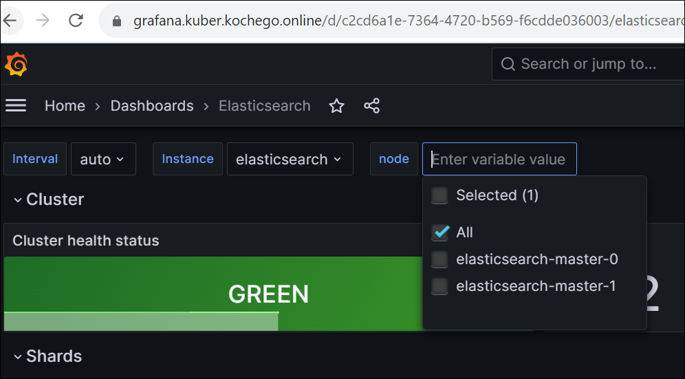

### Подготовка к работе
Создан кластер в Yandex Cloud - Managed Service for Kubernetes

Созданы две группы узлов - default-pool 1 нода и infra-pool 3 ноды (taint node-role=infra:NoSchedule)

Зарегистрировано доменное имя kochego.online, которое используется для внешнего доступа к создаваемым ресурсам

В кластере развернуто приложение hipster-shop (использованы helm чарты из ДЗ kubernetes-templating)

Приложение доступно по адресу https://shop.kuber.kochego.online

#### Установим nginx-ingress - три реплики
```bash
kubectl create ns nginx-ingress && \
helm repo add ingress-nginx https://kubernetes.github.io/ingress-nginx && \
helm repo update && \
helm install ingress-nginx ingress-nginx/ingress-nginx --namespace=nginx-ingress -f kubernetes-logging/nginx.values.yaml \
--version=4.7.0
```

Создадим ns, в котором будем работать
```bash
k create ns observability
```

### Установка EFK стека
#### ElasticSearch
Сперва подключаем mirror-репозиторий, так как репозиторий elastic заблокирован в нашей стране
```bash
helm repo add elastic-mirror https://elastic.comcloud.xyz
```
Пуллим чарты ES, чтобы использовать локальную копию и подменить значения в Values при установке - там есть ссылки на докер репозитории, которые тоже заблокированы
```bash
helm pull elastic-mirror/elasticsearch --untar --untardir kubernetes-logging
helm upgrade --install elasticsearch kubernetes-logging/elasticsearch \
--namespace observability -f kubernetes-logging/elasticsearch.values.yaml
```
Проверка ES:
```bash
kubectl get pods -n observability -o wide
```


#### Kibana
```bash
helm pull elastic-mirror/kibana --untar --untardir kubernetes-logging
helm upgrade --install kibana kubernetes-logging/kibana \
--namespace observability -f kubernetes-logging/kibana.values.yaml
```
Проверка Kibana:
```bash
kubectl get pods --namespace=observability -l release=kibana -w
```

Kibana доступна через ingress по адресу https://kibana.kuber.kochego.online
Логин elastic, пароль получить из секретов:
```bash
kubectl get secrets --namespace=observability elasticsearch-master-credentials -ojsonpath='{.data.password}' | base64 -d
```

#### Fluent Bit
Примечание: В values указан пароль
```bash
helm repo add fluent https://fluent.github.io/helm-charts
helm upgrade --install fluent-bit fluent/fluent-bit -n observability -f kubernetes-logging/fluent-bit.values.yaml --atomic
```
Если соединение отработало успешно, то будут доступны данные


Fluent-bit сконфигурирован на прием логов из кластера Kubernetes и на отправку их в Elasticsearch. Логи микросервисов Hipster-shop можно посмотреть в Kibana:

Описанная в методичке проблема с дубликатами полей не воспроизводится.

### Мониторинг ElasticSearch

#### Устанавливаем Kube Prometheus Stack:
```bash
helm repo add prometheus-community https://prometheus-community.github.io/helm-charts && \
helm upgrade --install prometheus prometheus-community/kube-prometheus-stack -n observability -f kubernetes-logging/prometheus-operator.values.yaml
```
Проверяем
```bash
kubectl --namespace observability get pods -l "release=prometheus"
```

#### Устанавливаем Prometheus Elasticsearch Exporter:
Примечание: В values указан пароль
```bash
helm upgrade --install elasticsearch-exporter prometheus-community/prometheus-elasticsearch-exporter -n observability -f kubernetes-logging/prometheus-elasticsearch-exporter.values.yaml --atomic
```
Логинимся в Графану https://grafana.kuber.kochego.online с паролем из values и импортируем дэшборд https://grafana.com/grafana/dashboards/4358-elasticsearch/

Уроним одну ноду
```bash
kubectl drain cl1u92qnj5m12sicrg3t-emyw --ignore-daemonsets --delete-emptydir-data
```
Статус Cluster Health остался зеленым, но количество нод в кластере уменьшилось до двух штук. При этом, кластер сохранил полную работоспособность.

Пробуем уронить еще одну ноду
```bash
kubectl drain cl1u92qnj5m12sicrg3t-ocyr --ignore-daemonsets --delete-emptydir-data
```
Видим, что PDB не дает это сделать

Удаляем второй под руками и видим, что кластер ES перестал быть работоспособным
```bash
k delete pod/elasticsearch-master-1 -n observability
```

Возвращаем ноды в строй и восстанавливаем работу кластера
```bash
kubectl uncordon cl1u92qnj5m12sicrg3t-ocyr cl1u92qnj5m12sicrg3t-emyw
```


### EFK | nginx ingress
Чтобы появились логи поменяем fluentbit.values.yaml и nginx-ingress.values.yaml, применим
helm upgrade --install ingress-nginx ingress-nginx/ingress-nginx --namespace=nginx-ingress -f kubernetes-logging/nginx.values.yaml \
--version=4.7.0

### Loki
```bash
helm repo add grafana https://grafana.github.io/helm-charts && \
helm repo update && \
helm upgrade --install loki grafana/loki-stack --namespace=observability -f kubernetes-logging/loki.values.yaml --atomic && \
helm upgrade --install prometheus prometheus-community/kube-prometheus-stack --namespace=observability -f kubernetes-logging/prometheus-operator.values.yaml --atomic
```
Локи был добавлен в качестве data source:


В Графане смотрим логи:


Включим serviceMonitor для Nginx:
```bash
helm upgrade --install ingress-nginx ingress-nginx/ingress-nginx --namespace=nginx-ingress \
-f kubernetes-logging/nginx.values.yaml \
--set controller.metrics.enabled=true \
--set controller.metrics.serviceMonitor.enabled=true \
--set controller.metrics.serviceMonitor.additionalLabels.release="kube-prometheus-stack" \
--version=4.7.0
```
Cоздадим Dashboard для Nginx:

